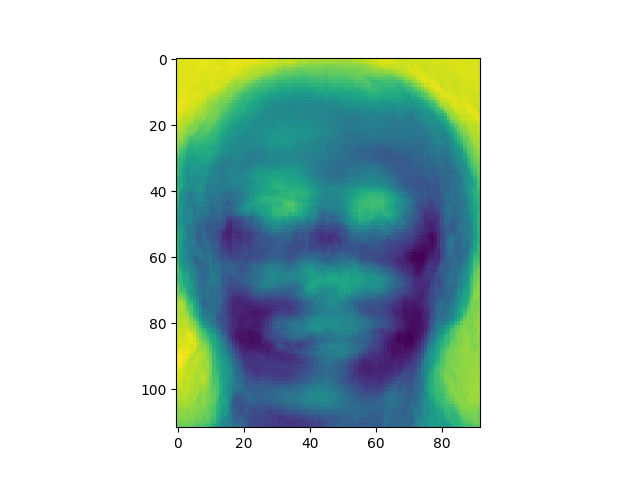

### Eigenface based face recognisation system
This repository contains the implementation of face recognition system based on eigenfaces. The main idea behind this method is to use eigenfaces which are obtained using dimensionality reduction technique - PCA[Principal component analysis]. Most of the face structure are similar in all the faces, which makes most of the features redundant. PCA leverages this fact and uses only selected features that are important in distinguishing the faces. Dataset used : [ORL Face Database](https://www.cl.cam.ac.uk/research/dtg/www/)

### Requirements :
* python >= 3.6.8
* numpy >= 1.15.4
* scikit-learn >= 0.20.1
* matplotlib >= 3.0.2


### Usage

#### To test the system and get the accuracy
```
python main.py
Hyperparameter : THRESHOLD = 40000, K = 20
```
With above hyperparamters accuracy = 0.95
#### To get the eigenfaces
```
python get_eigenfaces.py
Hyperparameter :  IMAGE_SIZE = (112, 92), K = 20
```



### Usefull Links :
* https://sites.cs.ucsb.edu/~mturk/Papers/mturk-CVPR91.pdf
* http://www.vision.jhu.edu/teaching/vision08/Handouts/case_study_pca1.pdf
* https://www.cl.cam.ac.uk/research/dtg/www/
