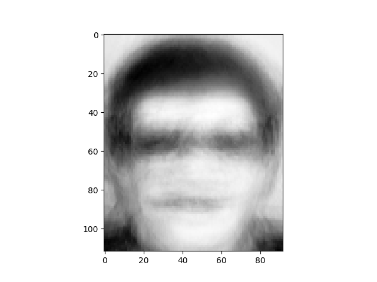

### Eigenface based face recognisation system


### Requirements :
* python3
* numpy >= 1.15.4
* scikit-learn >= 0.20.1
* matplotlib >= 3.0.2


### Usage

#### To test the system and get the accuracy
```
python main.py
Hyperparameter : THRESHOLD = 30000, K = 20
```

#### To get the eigenfaces
```
python get_eigenfaces.py
Hyperparameter :  IMAGE_SIZE = (112, 92), K = 20
```

